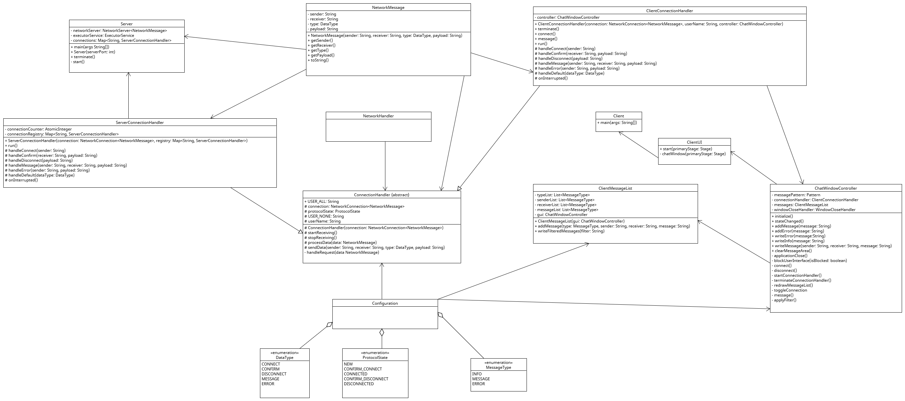

# MultiChat
MultiChat is a server/client communication application that allows you to chat with multiple people at once.

## Requirements
- Java 17 or higher
- Gradle 7.6 or higher

## Running the program
Run the Server and Client from an IDE or from the command line using the following commands:
```
gradle server:run
``` 
And in a separate terminal window:
```
gradle client:run
```

## Issues
The issues have been split into two main categories:

- [Structural Issues](https://github.zhaw.ch/PM2-IT22tbZH-wahl-krea/uebung-hk1-verdiant-iselival-monterap/issues?q=is%3Aissue+label%3Astructural) - All issues that have to do with architecture, clean-code, JavaDoc, etc.
- [Bugs](https://github.zhaw.ch/PM2-IT22tbZH-wahl-krea/uebung-hk1-verdiant-iselival-monterap/issues?q=is%3Aissue+label%3Afunctional) - Issues related to functionality that doesn't work as specified.

View [All Open Issues](https://github.zhaw.ch/PM2-IT22tbZH-wahl-krea/uebung-hk1-verdiant-iselival-monterap/issues?q=is%3Aissue+is%3Aopen)

## Class diagram


### Client
The Client implements the Model-View-Controller pattern, which allows for a better separation of concerns.
The Model is represented by ```ClientConnectionHandler```, which is responsible for all incoming and outgoing messages from the client to the server.
```Client``` is the class responsible for starting the JavaFX GUI. The View itself is in ```ChatWindow.fxml```. For the Controller we have ```ChatWindowController```, which is responsible for handling all user interactions with the GUI and acts as a bridge between the Model and View.

The client is multithreaded, as it has to wait for incoming messages from the server and for user input at the same time. This is achieved by using a ```ExecutorService```, which is responsible for waiting for incoming messages.

### Protocol
```ConnectionHandler``` provides the logic for sending and receiving messages. It is used by both the Client and the Server, in ```ClientConnectionHandler``` and ```ServerConnectionHandler``` respectively. The protocol is defined in ```NetworkHandler```, which is used by ```ConnectionHandler``` to parse incoming messages and to create outgoing messages.

```NetworkMessage``` is an object to efficiently store message data between client and server. It allows for easy access to each parameter of a message (sender, receiver, data type, message) and serialization to a string.

To eliminate code duplication, ```Configuration``` holds all enums and constants used by the client and server.

### Server
Like the client, the server is also multithreaded. All connections are listening for new messages in a separate thread, which is managed by a ```ExecutorService```.

```ServerConnectionHandler``` is responsible for all incoming and outgoing messages from the server to the client. It also manages the list of all clients connected to the server.
```Server``` is the class responsible for starting the server.

When the ```Server``` is interrupted, it shuts down all connections and stops listening for new connections, while also signaling all clients that the server is shutting down.

## Future enhancements
- implement channels (e.g. in Teams or Slack), so that clients can communicate on a specific topic. This would require the creation of a new class ```Channel``` and extending the ```NetworkMessage``` class.
- create a login system, so that clients can identify themselves. With the use of a database
- other use for a database is to store previous messages
- implement the ability to send emoticons, images or files. This could be done by extending the ```NetworkMessage``` class.

## Authors
- verdiant (Michael Verdile)
- iselival (Valentin Iseli)
- monterap (Raphael Monteiro)
